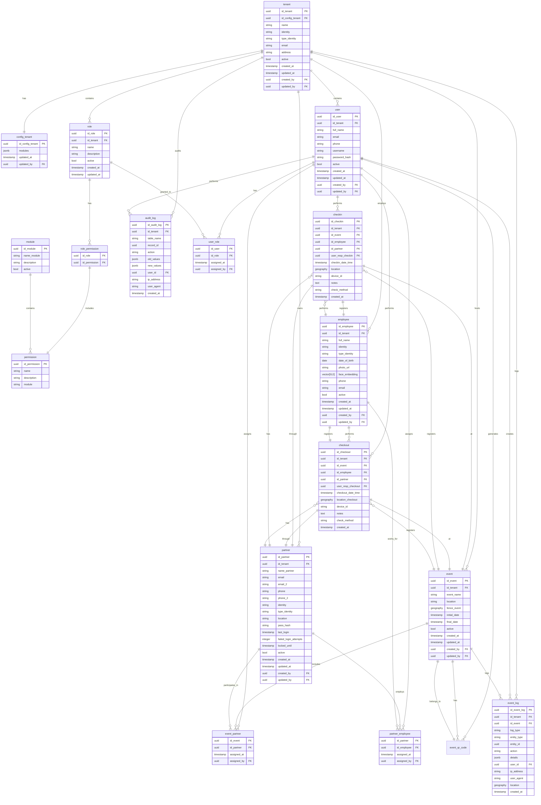

# Diagrama do Banco de Dados - Sistema de Check-in em Eventos

```mermaid
erDiagram
    %% Entidades principais
    tenant {
        uuid id_tenant PK
        uuid id_config_tenant FK
        string name
        string identity
        string type_identity
        string email
        string address
        bool active
        timestamp created_at
        timestamp updated_at
        uuid created_by FK
        uuid updated_by FK
    }

    config_tenant {
        uuid id_config_tenant PK
        jsonb modules
        timestamp updated_at
        uuid updated_by FK
    }

    user {
        uuid id_user PK
        uuid id_tenant FK
        string full_name
        string email
        string phone
        string username
        string password_hash
        bool active
        timestamp created_at
        timestamp updated_at
        uuid created_by FK
        uuid updated_by FK
    }

    role {
        uuid id_role PK
        uuid id_tenant FK
        string name
        string description
        bool active
        timestamp created_at
        timestamp updated_at
    }

    permission {
        uuid id_permission PK
        string name
        string description
        string module
    }

    module {
        uuid id_module PK
        string name_module
        string description
        bool active
    }

    event {
        uuid id_event PK
        uuid id_tenant FK
        string event_name
        string location
        geography fence_event
        timestamp initial_date
        timestamp final_date
        bool active
        timestamp created_at
        timestamp updated_at
        uuid created_by FK
        uuid updated_by FK
    }

    partner {
        uuid id_partner PK
        uuid id_tenant FK
        string name_partner
        string email
        string email_2
        string phone
        string phone_2
        string identity
        string type_identity
        string location
        string pass_hash
        timestamp last_login
        integer failed_login_attempts
        timestamp locked_until
        bool active
        timestamp created_at
        timestamp updated_at
        uuid created_by FK
        uuid updated_by FK
    }

    employee {
        uuid id_employee PK
        uuid id_tenant FK
        string full_name
        string identity
        string type_identity
        date date_of_birth
        string photo_url
        vector[512] face_embedding
        string phone
        string email
        bool active
        timestamp created_at
        timestamp updated_at
        uuid created_by FK
        uuid updated_by FK
    }

    checkin {
        uuid id_checkin PK
        uuid id_tenant FK
        uuid id_event FK
        uuid id_employee FK
        uuid id_partner FK
        uuid user_resp_checkin FK
        timestamp checkin_date_time
        geography location
        string device_id
        text notes
        string check_method
        timestamp created_at
    }

    checkout {
        uuid id_checkout PK
        uuid id_tenant FK
        uuid id_event FK
        uuid id_employee FK
        uuid id_partner FK
        uuid user_resp_checkout FK
        timestamp checkout_date_time
        geography location_checkout
        string device_id
        text notes
        string check_method
        timestamp created_at
    }

    event_log {
        uuid id_event_log PK
        uuid id_tenant FK
        uuid id_event FK
        string log_type
        string entity_type
        uuid entity_id
        string action
        jsonb details
        uuid user_id FK
        string ip_address
        string user_agent
        geography location
        timestamp created_at
    }

    audit_log {
        uuid id_audit_log PK
        uuid id_tenant FK
        string table_name
        uuid record_id
        string action
        jsonb old_values
        jsonb new_values
        uuid user_id FK
        string ip_address
        string user_agent
        timestamp created_at
    }

    %% Tabelas de relacionamento
    event_partner {
        uuid id_event FK
        uuid id_partner FK
        timestamp assigned_at
        uuid assigned_by FK
    }

    partner_employee {
        uuid id_partner FK
        uuid id_employee FK
        timestamp assigned_at
        uuid assigned_by FK
    }

    user_role {
        uuid id_user FK
        uuid id_role FK
        timestamp assigned_at
        uuid assigned_by FK
    }

    role_permission {
        uuid id_role FK
        uuid id_permission FK
    }

    %% Relacionamentos
    tenant ||--|| config_tenant : has
    tenant ||--o{ user : contains
    tenant ||--o{ role : contains
    tenant ||--o{ event : hosts
    tenant ||--o{ partner : owns
    tenant ||--o{ employee : employs
    tenant ||--o{ event_log : logs
    tenant ||--o{ audit_log : audits
    
    user ||--o{ user_role : has
    user ||--o{ event_partner : assigns
    user ||--o{ partner_employee : assigns
    user ||--o{ checkin : performs
    user ||--o{ checkout : performs
    user ||--o{ event_log : creates
    user ||--o{ audit_log : performs
    user ||--o{ event_qr_code : generates
    
    role ||--o{ user_role : granted_to
    role ||--o{ role_permission : has
    role_permission ||--|| permission : includes
    
    module ||--o{ permission : contains
    
    event ||--o{ event_partner : includes
    event ||--o{ checkin : registers
    event ||--o{ checkout : registers
    event ||--o{ event_log : logs
    event ||--o{ event_qr_code : has
    
    partner ||--o{ event_partner : participates_in
    partner ||--o{ partner_employee : employs
    partner ||--o{ checkin : has
    partner ||--o{ checkout : has
    
    employee ||--o{ partner_employee : works_for
    employee ||--o{ checkin : performs
    employee ||--o{ checkout : performs
    
    checkin ||--|| employee : registers
    checkin ||--|| event : at
    checkin ||--|| partner : through
    
    checkout ||--|| employee : registers
    checkout ||--|| event : at
    checkout ||--|| partner : through
    
    event_qr_code ||--|| event : belongs_to
```